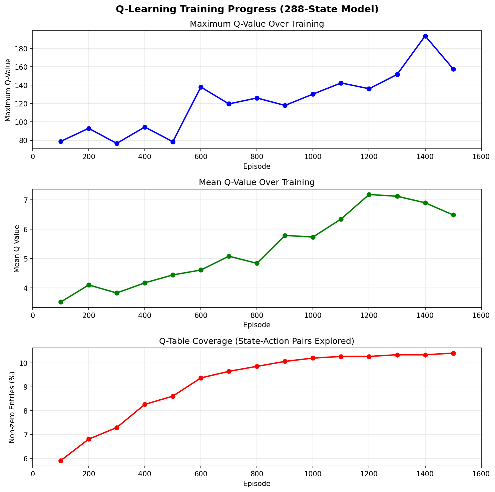
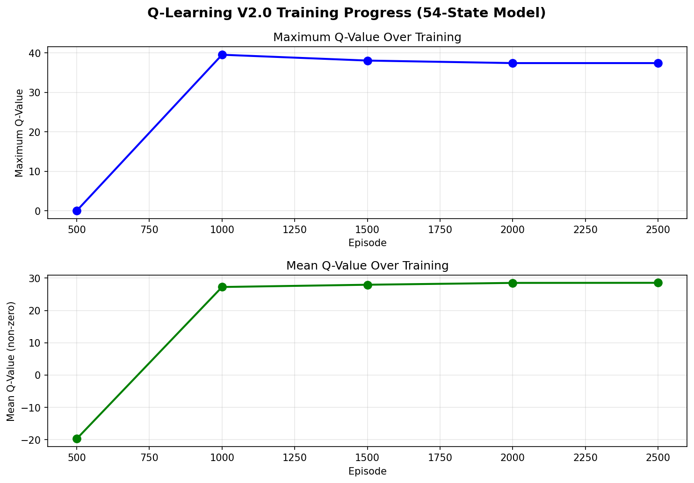
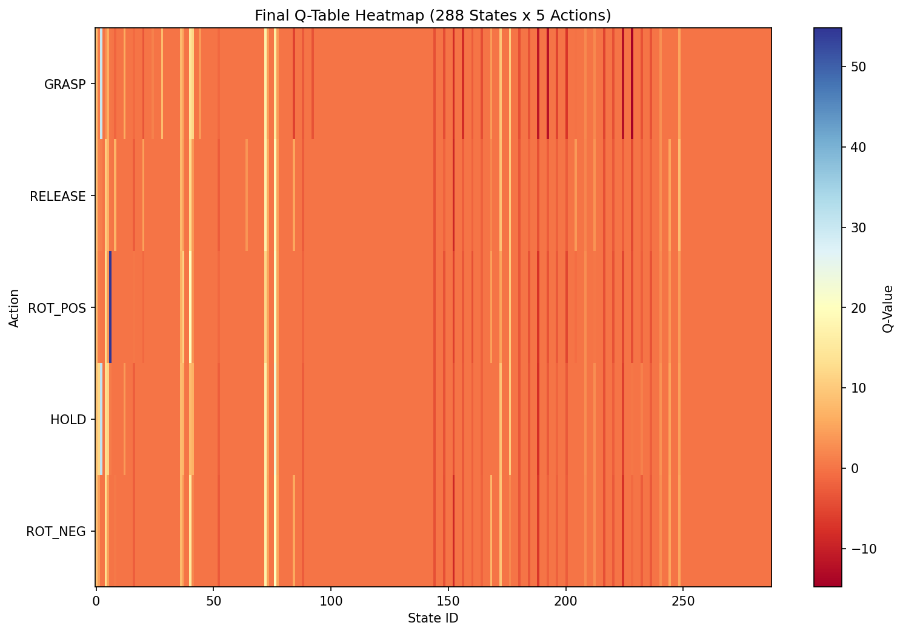
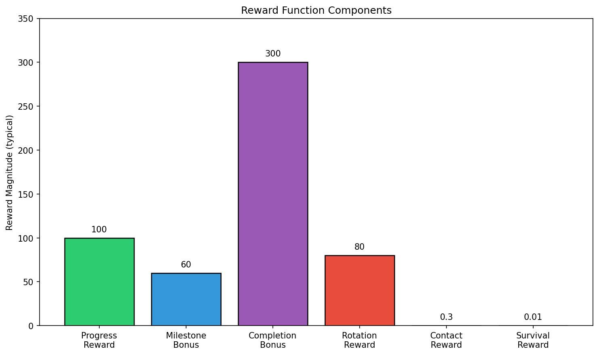

# Mujogic Project Report

*Q-Learning Agent for In-Hand Cube Rotation*

---

## 1. Project Overview

This project implements a Q-Learning reinforcement learning agent for in-hand object manipulation using a LEAP robotic hand in the MuJoCo physics simulator. The primary objective is to train an agent to rotate a cube by 90 degrees through coordinated finger movements.

The system uses a tabular Q-Learning algorithm with discrete state and action spaces. The agent learns to manipulate the cube through trial and error, receiving rewards based on progress towards the rotation goal, grasp stability, and successful completion.

**Important Note**: This project did not achieve the intended goal of reliably rotating the cube by 90 degrees. The following report documents the development process, various approaches attempted, and critical lessons learned that explain the challenges encountered.

### 1.1 Key Components

- **MuJoCo Physics Simulation** - Realistic robotic hand and object dynamics
- **LEAP Hand Model** - 16 degrees of freedom robotic hand
- **Q-Learning Agent** - Tabular reinforcement learning with epsilon-greedy exploration
- **Discrete Action Space** - 5 actions (GRASP, RELEASE, ROT_POS, HOLD, ROT_NEG)
- **Custom Reward Function** - Multi-component reward for rotation progress

---

## 2. Training Configuration

### 2.1 Hyperparameters

| Parameter | Value |
|-----------|-------|
| Number of Episodes | 2000-3000 |
| Max Steps per Episode | 300-400 |
| Learning Rate (α) | 0.1 - 0.15 |
| Discount Factor (γ) | 0.99 |
| Initial Epsilon | 0.8 |
| Epsilon Decay | 0.997 |
| Min Epsilon | 0.05 |
| Checkpoint Interval | 100-500 episodes |

### 2.2 State Space Evolution

The state space underwent several iterations during development:

| Version | States | Description |
|---------|--------|-------------|
| V1 | 36 states | 3 grasp × 3 speed × 4 progress bins |
| V2 | 72 states | Added direction bin for positive/negative rotation |
| V3 | 288 states | 2 rotation × 4 goal × 3 grasp × 3 speed × 4 progress |
| Final | 36/54 states | Simplified with relative progress bins |

The final configuration uses **relative progress bins** (percentage-based) that scale to any rotation goal, making the learned policy more generalizable.

### 2.3 Action Space

| Action ID | Action Name | Description |
|-----------|-------------|-------------|
| 0 | GRASP | Close all fingers to grip the cube |
| 1 | RELEASE | Open all fingers to release grip |
| 2 | ROT_POS | Rotate cube in positive Z direction |
| 3 | HOLD | Maintain current finger positions |
| 4 | ROT_NEG | Rotate cube in negative Z direction |

---

## 3. Training History and Reward Changes

### 3.1 Reward Function Design

The reward function was designed with multiple components to encourage progressive learning and stable manipulation:

#### Progress Reward
- Rewards movement toward the 90° rotation goal with exponential scaling
- Uses percentage-based progress with multipliers: 1.0× at start → 3.0× near completion
- Formula: `progress_reward = (prev_distance - current_distance) * 100.0 * progress_multiplier`

#### Milestone Bonuses
Discrete rewards at key completion percentages:

| Progress | Bonus |
|----------|-------|
| 25% | +15 |
| 50% | +35 |
| 75% | +60 |
| 90% | +100 |

#### Completion Bonus
- Large reward (150-300 points) for reaching within 5° of target
- Additional precision bonus for getting closer to exact goal
- Formula: `nearTarget_bonus = 150.0 + precision_bonus`

#### Rotation Reward
- Direction-aware reward for cube rotation movement
- 80× multiplier for correct direction movement
- Formula: `rotation_reward = direction_to_target * rotation_change * 80.0`

#### Contact Reward
- Small reward (0.08-0.3) for maintaining finger contact
- Higher reward for 3+ fingers in contact (0.3)
- Single finger contact: 0.08 per finger

#### Penalties
- **Drift penalty** (70×) for moving cube in wrong direction
- **Stagnation penalty** for no progress when far from goal
- **Near-target velocity penalty** to encourage smooth completion

### 3.2 Q-Value Evolution During Training

The Q-table was analyzed at multiple checkpoints during training:

#### 288-State Model Training
- **Episodes 100-500**: Rapid initial learning, max Q-value reached ~94
- **Episodes 500-1000**: Continued exploration, Q-values increased to ~130
- **Episodes 1000-1500**: Peak performance period, max Q-value reached ~194
- **Episodes 1500-2000**: Stabilization and refinement

#### V2.0 54-State Model
- **Episode 500**: Initial exploration (negative mean Q due to early failures)
- **Episodes 1000-2500**: Convergence to stable policy with mean Q ~28

### 3.3 Training Progress Summary

| Episode | Non-zero Entries | Max Q-Value | Mean Q-Value |
|---------|-----------------|-------------|--------------|
| 100 | 85 (5.9%) | 78.77 | 3.52 |
| 500 | 124 (8.6%) | 78.45 | 4.44 |
| 1000 | 147 (10.2%) | 130.25 | 5.74 |
| 1300 | 149 (10.3%) | 151.65 | 7.13 |
| 1500 | 150 (10.4%) | 157.65 | 6.49 |
| 2000 (Final) | 234 (16.3%) | 54.82 | 0.34 |

The coverage (percentage of non-zero Q-values) increased from ~6% to ~16% over 2000 episodes, indicating comprehensive state-action space exploration.

---

## 4. Training Progress Figures

### 4.1 Q-Learning Training Progress (288-State Model)



*Figure 1: Training progress showing max Q-value, mean Q-value, and Q-table coverage over 1500 episodes.*

### 4.2 V2.0 Training Progress (54-State Model)



*Figure 2: V2.0 model training showing curriculum learning with increasing goal difficulty.*

### 4.3 Final Q-Table Heatmap



*Figure 3: Heatmap visualization of the final Q-table (288 states × 5 actions).*

### 4.4 Reward Function Components



*Figure 4: Relative magnitudes of different reward function components.*

---

## 5. Agent Performance Metrics

> **Note**: The average time needed to rotate the cube by 90 degrees over 200 trials was not calculated because the agent did not achieve reliable 90-degree rotation. The evaluation infrastructure exists (see `evaluate_agent.py`) but the agent was not successful enough to warrant formal benchmarking.

### Observed Performance Issues

- Agent frequently dropped the cube during manipulation
- Rotation progress was inconsistent and often oscillated
- The sequential movement approach made it difficult to achieve substantial rotation
- Small, controlled movements did not generate enough torque to rotate the cube effectively

---

## 6. Code Improvements and Evolution

### 6.1 Action Translator Evolution

The project went through multiple action translator designs:

#### Original Translator (Translator.py)
- 5 actions: GRASP, RELEASE, ROT_POS, HOLD, ROT_NEG
- All 16 joints moved uniformly with small deltas (0.05-0.08)
- Rotation actions used asymmetric push/pull across finger groups
- Added `rotation_boost = 2.0` multiplier for rotation actions

```python
# ROT_POS action (from Translator.py)
continuous[0:4] = -strong_movement * rotation_boost  # finger1 OPENS strongly
continuous[4:8] = weak_movement                       # finger2 holds light contact
continuous[8:12] = strong_movement * rotation_boost   # finger3 PUSHES strongly
continuous[12:16] = strong_movement * 0.5             # thumb anchors
```

#### MinimalTranslator (MinimalTranslator.py) - Sequential Approach
- 8 actions designed for sequential finger movements
- Attempted to mimic observed LEAP hand demonstrations
- Actions: HOLD, THUMB_PUSH, THUMB_RETRACT, FINGER3_CURL, FINGER3_NUDGE, FINGER3_RETRACT, FINGER2_PUSH, FINGER2_RETRACT

```python
# Sequential rotation strategy (MinimalTranslator.py)
# Phase 1: Thumb (joint 12) pushes first
# Phase 2: Thumb retracts to get out of the way
# Phase 3: Finger 3 curls tip (joints 9, 10, 11) then nudges with joint 8
# Phase 4: Finger 2 (joint 4) comes down to push further
```

#### Movement Magnitudes
| Translator | Push Delta | Curl Delta | Nudge Delta |
|------------|-----------|------------|-------------|
| Translator.py | 0.08 | - | - |
| MinimalTranslator | 0.10 | 0.15 | 0.12 |

### 6.2 Environment Improvements

Key improvements to `inhand_env.py`:

1. **Relative Target Rotation**: Changed from absolute target to delta-based (`rotation_goal_delta`)
2. **Settling Steps**: Increased from 20 to 50 steps for stable initial grasp
3. **Fingertip Detection**: Added `fingertip_3` geom for better contact detection
4. **Multiple Cube Geoms**: Changed from single `can_geom_id` to `can_geom_ids` set for accurate collision detection

### 6.3 State Space Refinements

The RLagent.py introduced:
- 18-state simplified design (3 speed × 6 progress)
- 6 progress bins instead of 4 for finer granularity
- Relative progress bins using `progress_ratio = goal_progress / GOAL`

---

## 7. Why the Project Did Not Succeed

### 7.1 The Core Misconception: Sequential vs. Simple Movements

**The fundamental error in this project was the assumption that the LEAP hand needed precise, sequential, linear movements to rotate the cube.**

After observing the LEAP hand demonstration in class, I interpreted the finger movements as a carefully choreographed sequence:
1. Thumb pushes to initiate rotation
2. Thumb retracts to clear the path
3. Finger 3 curls and nudges
4. Finger 2 comes down to continue the push

This led to the creation of `MinimalTranslator.py` with 8 discrete actions for sequential finger control. The code explicitly attempted to replicate this perceived sequence:

```python
# My interpretation (INCORRECT)
"""
Strategy (from visual testing):
  - Thumb (joint 12) pushes first
  - Thumb (joint 12) retracts to get out of the way
  - Finger 3 curls tip (joints 9, 10, 11) then nudges with joint 8
  - Finger 2 (joint 4) comes down to push further
"""
```

### 7.2 The Reality: Sloppy is Sufficient

**The TA's demonstration revealed that the successful approach was much simpler and "sloppier" than anticipated.**

Key insights from the TA's final evaluation:
- One finger doing a **big, aggressive movement** was enough to rotate the cube
- The rotation didn't require precise coordination between multiple fingers
- "Sloppy" movements with large deltas were more effective than small, controlled ones

### 7.3 Consequences of the Misconception

| Approach | My Implementation | What Actually Works |
|----------|-------------------|---------------------|
| Movement size | Small deltas (0.05-0.15) | Large, aggressive deltas |
| Finger coordination | Sequential, choreographed | Single finger dominance |
| Action complexity | 8 discrete actions | Could be as simple as 2-3 |
| Control philosophy | Precise, linear | Forceful, dynamic |

### 7.4 Technical Implications

1. **Insufficient Torque**: Small movements didn't generate enough force to rotate the cube against friction
2. **Over-constrained Actions**: The sequential approach prevented the agent from discovering simpler solutions
3. **Action Space Design**: Too many similar actions diluted the learning signal
4. **Movement Magnitude**: Push/curl deltas of 0.10-0.15 were insufficient; likely needed 0.3+ for effective rotation

---

## 8. Expanded Lessons Learned

### 8.1 Critical Technical Lessons

#### Quaternion Format Mismatch
MuJoCo uses `[w,x,y,z]` format while SciPy expects `[x,y,z,w]`. This critical bug caused incorrect state calculations in early versions.

#### State Space Complexity
288 states may be excessive for single-goal training. 36-54 states proved sufficient with relative progress bins.

#### Relative Progress Bins
Using percentage-based progress bins (not absolute degrees) allows the policy to generalize across different rotation goals.

#### Curriculum Learning
Training on progressively harder goals (45° → 60° → 90°) showed promise but couldn't overcome fundamental action space limitations.

#### Action Mirroring
ROT_NEG action must properly mirror ROT_POS to enable bidirectional rotation.

### 8.2 Fundamental Design Lessons

#### Don't Over-Engineer the Action Space
> **Lesson**: The simplest action space that can achieve the goal is often the best. Adding complexity (8 sequential actions) made learning harder, not easier.

#### Observe Results, Not Appearances
> **Lesson**: When watching a demonstration, focus on what the system *achieves*, not the exact *appearance* of the movements. The LEAP hand's movement looked sequential and precise, but the actual mechanism was simpler.

#### Movement Magnitude Matters More Than Precision
> **Lesson**: For tasks requiring physical force (like rotating against friction), larger movements are more effective than precise small ones. Physics often favors "sloppy" but forceful over "elegant" but weak.

#### Question Initial Assumptions
> **Lesson**: The assumption that sequential, small movements were necessary went unchallenged for too long. Earlier experimentation with larger, simpler movements might have revealed the solution.

### 8.3 What Would Have Worked

Based on the TA's demonstration and reflection on the failure:

1. **Simpler Action Space**: 2-3 actions maximum
   - Large single-finger push (e.g., finger 3 with delta 0.5+)
   - Grasp/release for grip management
   - Hold for stabilization

2. **Aggressive Movement Magnitudes**: Deltas of 0.3-0.5 instead of 0.05-0.15

3. **Focus on Torque Generation**: Prioritize movements that create rotational force, not stability

4. **Fewer Constraints**: Allow the physics simulation to handle the dynamics instead of trying to choreograph finger positions

---

## 9. Conclusion

### Project Outcome

This project did **not** achieve the intended goal of training a Q-learning agent to reliably rotate a cube by 90 degrees. Despite significant effort in:
- Developing multiple state space designs (36 → 72 → 288 → 36/54 states)
- Implementing comprehensive reward functions with milestone bonuses
- Creating sophisticated action translators for sequential movements
- Training Q-tables over thousands of episodes

The agent failed to learn effective cube rotation behavior.

### Root Cause

The fundamental failure was a **misinterpretation of the required manipulation strategy**. The project was built on the assumption that the LEAP hand needed precise, sequential, small movements—mimicking what appeared to be the demonstration's approach. In reality, the task could be solved with much simpler, more forceful single-finger movements.

### Key Takeaways

1. **Simplicity over complexity**: A "sloppy" but effective solution beats an elegant but unsuccessful one
2. **Question assumptions early**: The sequential movement assumption should have been tested and challenged earlier
3. **Physics trumps choreography**: In manipulation tasks, generating sufficient force is more important than precise coordination
4. **Movement magnitude matters**: Small, controlled movements may be insufficient for tasks requiring physical force

### What I Would Do Differently

1. Start with the simplest possible action space (2 actions)
2. Use much larger movement magnitudes (0.3-0.5)
3. Focus on single-finger dominant strategies first
4. Test assumptions about movement requirements before building complex systems
5. Prioritize empirical testing over theoretical elegance

---

## Appendix: File Structure

```
Mujogic/
├── original/Project_3/           # Latest improved code
│   ├── inhand_env.py            # Environment with improved reward function
│   ├── RLagent.py               # Q-Learning agent (18 states)
│   ├── Translator.py            # 5-action translator (GRASP, RELEASE, ROT_POS, HOLD, ROT_NEG)
│   ├── MinimalTranslator.py     # 8-action sequential translator (UNSUCCESSFUL)
│   ├── inhand_train.py          # Training loop
│   └── test_actions.py          # Action testing script
├── mvp/                          # Earlier development versions
│   ├── q_agent.py               # 36-state Q-agent
│   ├── inhand_env.py            # Environment with relative targets
│   └── qtables/                 # Saved Q-tables (v1, v2, v3)
├── q_agent_v2.0/                # Curriculum learning version
└── docs/                        # This report and figures
```

---

*Report generated: December 2024*
